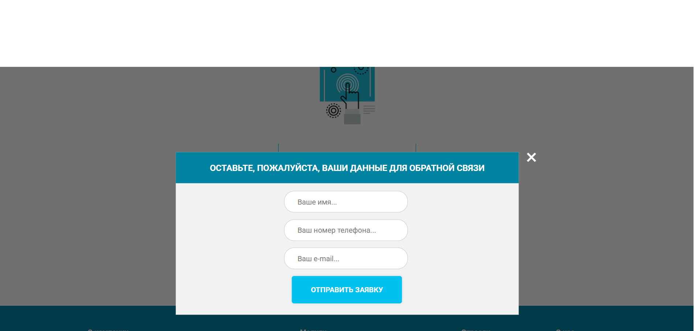

# Структура проекта

**Основные каталоги:**

```
.
├── dist/
│   ├── css/
│   │   └── libs/
│   ├── icons/
│   │   ├── access/
│   │   ├── advantages/
│   │   ├── countries/
│   │   ├── expert/
│   │   ├── favicon/
│   │   ├── footer/
│   │   ├── header/
│   │   ├── options/
│   │   └── promo/
│   │       └── carousel/
│   ├── img/
│   │   ├── expert/
│   │   ├── industry/
│   │   ├── options/
│   │   └── promo/
│   ├── js/
│   └── index.html
├── src/
│   ├── icons - аналогичная структура dist/
│   ├── img - аналогичная структура dist/
│   ├── js/
│   ├── sass/
│   │   ├── blocks/
│   │   └── libs/
│   └── index.html
├── db.json
├── gulpfile.js
├── package.json
├── package-lock.json
└── README.md

```

=======

# Prengi (JavaScript + SCSS)





## О проекте

Prengi - сайт компании, занимающейся разработкой мобильного приложения. На сайте реализован слайдер и формы обратной связи. Данные, которые ввел пользователь, направляются на сервер (json-server).

## Технологии

- gulp
- swiper
- SCSS
- json-server

## Установка и запуск

```bash
git clone https://github.com/NikRNN/Prengi.git
cd Prengi
npm install
npm gulp (для фронтенда)
npx json-server db.json (для сервера)
```
